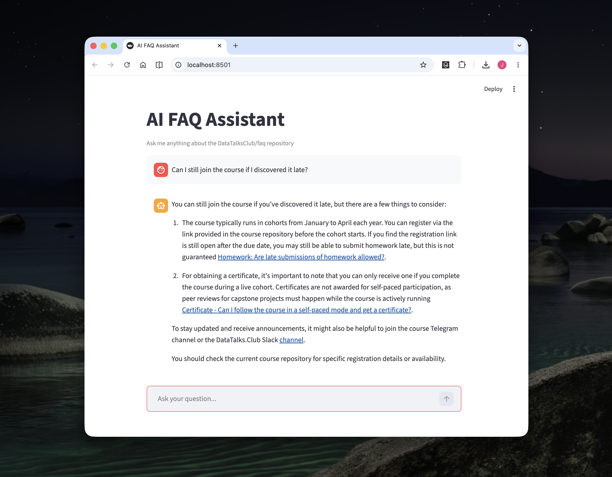

# AI FAQ Assistant

An AI-powered FAQ assistant for the DataTalksClub FAQ repository.

The assistant indexes the FAQ repository, lets users ask questions in a Streamlit chat interface, and answers using retrieved source material with references.

## Features

- Downloads and indexes FAQ content from GitHub
- Provides a Streamlit web interface
- Uses a search tool to retrieve relevant FAQ entries
- Answers user questions with source references
- Logs interactions for evaluation
- Includes evaluation notebooks for comparing prompt versions

## Demo

### Web app

The Streamlit app lets users ask questions about the DataTalksClub FAQ repository and receive answers with source references.



## Project structure

```text
.
├── app.py
├── ingest.py
├── search_agent.py
├── search_tools.py
├── logs.py
├── eval/
│   ├── data-gen.ipynb
│   ├── evaluations.ipynb
│   └── README_evaluation_section.md
├── images/
│   └── demo-streamlit.png
├── pyproject.toml
└── README.md